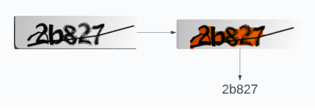

# captcha-solver
A text-based CAPTCHA solver powered by OpenCV and a fine-tuned docTR OCR model

## Motivations
Today, CAPTCHAs are text transcription or image recognition challenges used to defend websites and services from automated bots. This prevents them from brute-forcing online accounts' passwords, engaging in internet trolling, and other unwanted behavior. However, as machine learning technology has developed, text-base CAPTCHAs have become increasingly vulnerable to numerous machine learning-based transcription attacks.    

I've created this proof-of-concept to demonstrate the vulnerability of traditional text-based CAPTCHAs and demonstrate the internet's need to transition to image-based CAPTCHAs, which can defend better against machine learning-based attacks due to the vast number of objects in the real and fictional world, making training a neural network to recognize these objects more difficult. 

## How it Works
### 1. OpenCV Processing
CAPTCHA image goes through denoising (erosion and dilation), grayscaling, thresholding, and contour analysis to make the CRNN model processing more accurate by reducing the appearance of stray lines and other deformations.

### 2. CRNN Model
The OpenCV-processed image is processed through the CRNN Model to produce a transcription. It is a fine-tuned model based on this [dataset](https://www.kaggle.com/datasets/alizahidraja/captcha-data).
The resulting transcription should be better than that of a typical CRNN OCR model because it contains CAPTCHA deformations that may still remain from CAPTCHA processing.



## Quick Start
### 1. Install Prerequisites
#### i. Install GTK
For Windows Users: https://github.com/tschoonj/GTK-for-Windows-Runtime-Environment-Installer  
For Linux Users:
```
sudo apt-get update
sudo apt-get install libgtk-3-dev
```
For macOS Users:
```
brew install gtk+3
```

#### ii. Install Python Dependencies:
```
pip install -r requirements.txt
```

### 2. Transcribe a CAPTCHA
Using default CRNN model:
```
$ python inference.py image.png
Output: [transcribed_captcha]
```

Using your own custom-trained CRNN model with --reco_model_path:
```
$ python inference.py image.png --reco_model_path your_model.pt
Output: [transcribed_captcha]
```

### 3. (Optional) Fine-tune your own CRNN Model
See instructions [here](https://github.com/mindee/doctr/tree/main/references/recognition#data-format).

## Acknowledgements
I would like to express my gratitude to the developers of the Mindee Doctr project (https://github.com/mindee/doctr), released under the Apache 2.0 license. I fine-tuned their implementation of an OCR CRNN to help in the CAPTCHA transcription process.  

## Contributing
Feel free to modify and contribute!